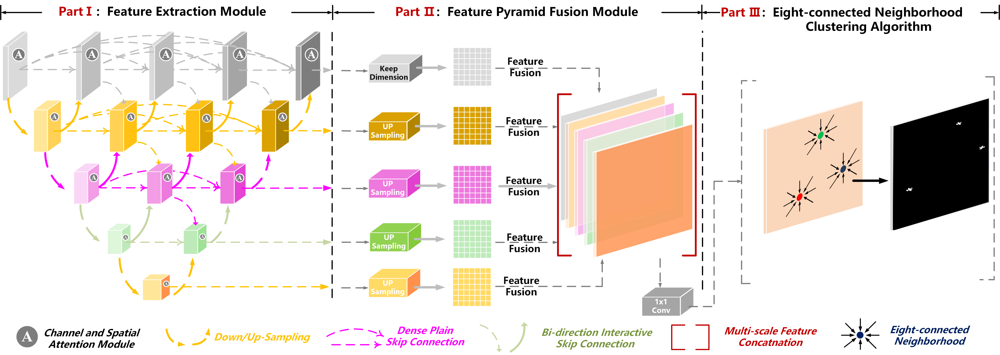
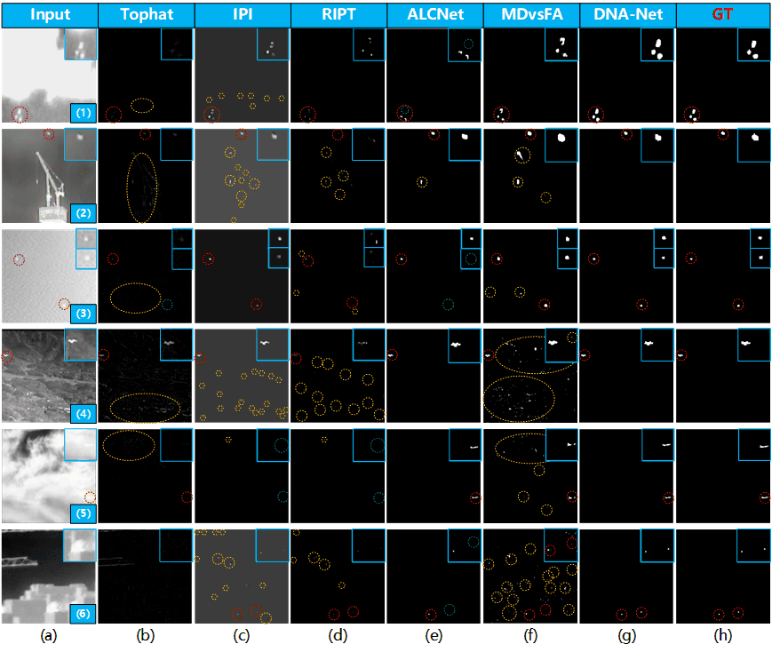

# Dense Nested Attention Network for Infrared Small Target Detection


## Algorithm Introduction

Dense Nested Attention Network for Infrared Small Target Detection, Boyang Li, Chao Xiao, Longguang Wang, and Yingqian Wang, arxiv 2021 [[Paper]](https://arxiv.org/pdf/2106.00487.pdf)

We propose a dense nested attention network (DNANet) to achieve accurate single-frame infrared small target detection and develop an open-sourced infrared small target dataset (namely, NUDT-SIRST) in this paper. Experiments on both public (e.g., NUAA-SIRST, NUST-SIRST) and our self-developed datasets demonstrate the effectiveness of our method. The contribution of this paper are as follows:
1. We propose a dense nested attention network (namely, DNANet) to maintain small targets in deep layers.
2. An open-sourced dataset (i.e., NUDT-SIRST) with rich targets.
3. Performing well on all existing SIRST datasets.

## Dataset Introduction
NUDT-SIRST is a synthesized dataset, which contains 1327 images with resolution of 256x256. The advantage of synthesized dataset compared to real dataset lies in three aspesets:
1. Accurate annotations.
2. Massive generation with low cost (i.e., time and money).
3. Numerous categories of target, rich target sizes, diverse clutter backgrounds.

## Citation
If you find the code useful, please consider citing our paper using the following BibTeX entry.
```
@article{li2021dense,
  title={Dense Nested Attention Network for Infrared Small Target Detection},
  author={Li, Boyang and Xiao, Chao and Wang, Longguang and Wang, Yingqian and Lin, Zaiping and Li, Miao and An, Wei and Guo, Yulan},
  journal={arXiv preprint arXiv:2106.00487},
  year={2021}
}
```

## Prerequisite
* Tested on Ubuntu 16.04, with Python 3.7, PyTorch 1.7, Torchvision 0.8.1, CUDA 11.1, and 1x NVIDIA 3090 and also 
* Tested on Windows 10  , with Python 3.6, PyTorch 1.1, Torchvision 0.3.0, CUDA 10.0, and 1x NVIDIA 1080Ti.
* [The NUDT-SIRST download dir](https://drive.google.com/drive/folders/1YGoYaBi9dLwoTwoeTytEs5m-VeeCDXf7?usp=sharing) (coming soon)
* [The NUAA-SIRST download dir](https://github.com/YimianDai/sirst)
* [The NUST-SIRST download dir](https://github.com/wanghuanphd/MDvsFA_cGAN) 


## Usage
#### On windows:
```
Click on train.py and run it. 
```

#### On Ubuntu:
#### 1. Train.

```bash
python train.py --base_size 256 --crop_size 256 --epochs 1500 --dataset [dataset-name] --split_method 50_50 --model [model name] --backbone resnet_18  --deep_supervision True --train_batch_size 16 --test_batch_size 16 --mode TXT
```

#### 2. Test.

```bash
python test.py --base_size 256 --crop_size 256 --st_model [trained model path] --model_dir [model_dir] --dataset [dataset-name] --split_method 50_50 --model [model name] --backbone resnet_18  --deep_supervision True --test_batch_size 1 --mode TXT 
```

#### (Optional) Visulize your predicts.

```bash
python visulization.py --base_size 256 --crop_size 256 --st_model [trained model path] --model_dir [model_dir] --dataset [dataset-name] --split_method 50_50 --model [model name] --backbone resnet_18  --deep_supervision True --test_batch_size 1 --mode TXT 
```

#### (Optiona2) Test and visulization.
```bash
python test_and_visulization.py --base_size 256 --crop_size 256 --st_model [trained model path] --model_dir [model_dir] --dataset [dataset-name] --split_method 50_50 --model [model name] --backbone resnet_18  --deep_supervision True --test_batch_size 1 --mode TXT 
```

#### (Optiona3) Demo (with your own IR image).
```bash
python demo.py --base_size 256 --crop_size 256 --img_demo_dir [img_demo_dir] --img_demo_index [image_name]  --model [model name] --backbone resnet_18  --deep_supervision True --test_batch_size 1 --mode TXT  --suffix [img_suffix]
```

## Results and Trained Models

#### Qualitative Results



#### Quantative Results 
on NUDT-SIRST
| Model         | mIoU (x10(-2)) | Pd (x10(-2))|  Fa (x10(-6)) ||
| ------------- |:-------------:|:-----:|:-----:|:-----:|
| DNANet-VGG-10 | 85.23 | 96.95 | 6.782|
| DNANet-ResNet-10| 86.36 | 97.39 | 6.897 |
| DNANet-ResNet-18| 87.09 | 98.73 | 4.223 |
| DNANet-ResNet-18| 88.61 | 98.42 | 4.30 | [[Weights]](https://drive.google.com/file/d/1NDvjOiWecfWNPaO12KeIgiJMTKSFS6wj/view?usp=sharing) |
| DNANet-ResNet-34| 86.87 | 97.98 | 3.710 |


on NUAA-SIRST
| Model         | mIoU (x10(-2)) | Pd (x10(-2))|  Fa (x10(-6)) ||
| ------------- |:-------------:|:-----:|:-----:|:-----:|
| DNANet-VGG-10 | 74.96 | 97.34 | 26.73 |
| DNANet-ResNet-10| 76.24 | 97.71 | 12.80 |
| DNANet-ResNet-18| 77.47 | 98.48 | 2.353 |
| DNANet-ResNet-18| 79.26 | 98.48 | 2.30 | [[Weights]](https://drive.google.com/file/d/1W0jFN9ZlaIdGFemYKi34tmJfGxjUGCRc/view?usp=sharing) |
| DNANet-ResNet-34| 77.54 | 98.10 | 2.510 |

This code is highly borrowed from [ACM](https://github.com/YimianDai/open-acm). Thanks to Yimian Dai.

## Referrences
1. Dai Y, Wu Y, Zhou F, et al. Asymmetric contextual modulation for infrared small target detection[C]//Proceedings of the IEEE/CVF Winter Conference on Applications of Computer Vision. 2021: 950-959. [[code]](https://github.com/YimianDai/open-acm) 
2. Zhou Z, Siddiquee M M R, Tajbakhsh N, et al. Unet++: Redesigning skip connections to exploit multiscale features in image segmentation[J]. IEEE transactions on medical imaging, 2019, 39(6): 1856-1867. [[code]](https://github.com/MrGiovanni/UNetPlusPlus)
3. He K, Zhang X, Ren S, et al. Deep residual learning for image recognition[C]//Proceedings of the IEEE conference on computer vision and pattern recognition. 2016: 770-778. [[code]](https://github.com/rwightman/pytorch-image-models)

## To Do
Upload NUDT-SIRST
